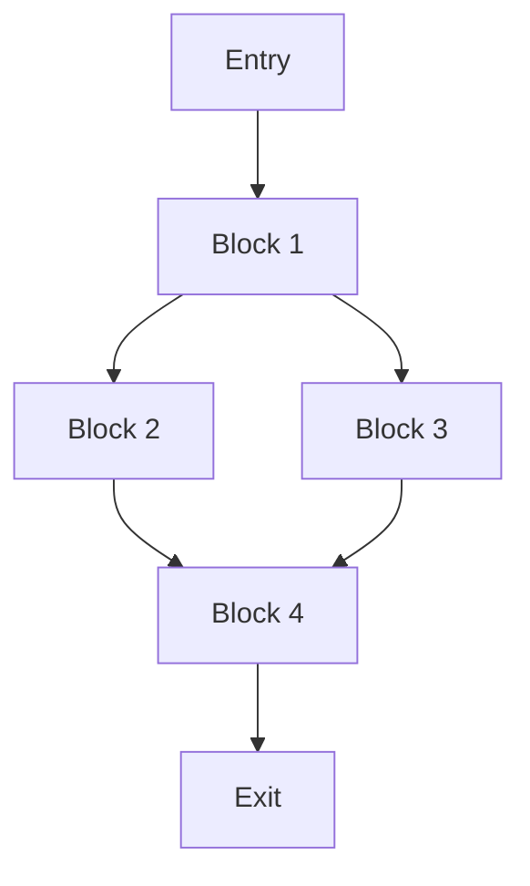
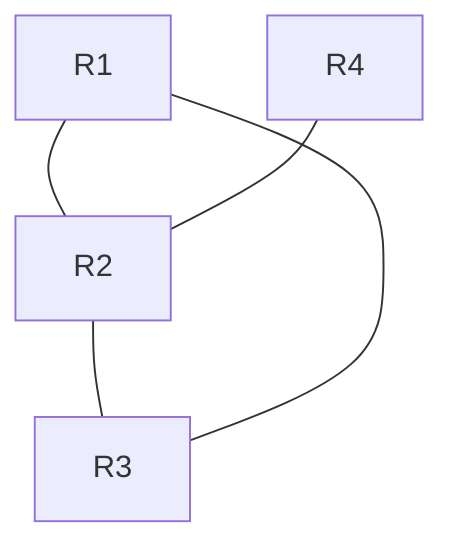
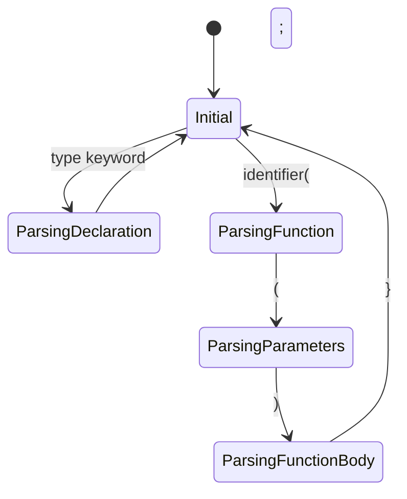

# Руководство по проектированию парсера C51 
## Функциональный подход к разработке компилятора

### Содержание
1. [Введение](#введение)
2. [Базовые концепции](#базовые-концепции)
3. [Структуры данных](#структуры-данных)
4. [Контракты и спецификации](#контракты-и-спецификации)
5. [Продвинутые техники](#продвинутые-техники)
6. [Семантический анализ](#семантический-анализ)
7. [Оптимизация и генерация кода](#оптимизация-и-генерация-кода)

## Введение

Данное руководство описывает процесс создания парсера для языка C51 с использованием функционального подхода в Clojure. Особое внимание уделяется структурам данных, типобезопасности и масштабируемости решения.

## Базовые концепции

### Токены и их представление

В функциональном программировании мы стремимся к использованию простых иммутабельных структур данных. Рассмотрим эволюцию представления токенов:

```clojure
;; Старый подход - строковые значения
(def void-keyword 
  {:type :void-type-keyword 
   :value "void"})

;; Новый подход - ключевые слова
(def void-keyword 
  {:type :void-type-keyword 
   :value :void})
```

Преимущества нового подхода:
- Более эффективное сравнение (ключи вместо строк)
- Меньше типов токенов
- Контекстная семантика (void как тип vs void как параметр)

### Состояние парсера

Состояние парсера представляет собой иммутабельную структуру:

```clojure
(def parser-state
  {:tokens []      ; вектор токенов
   :position 0     ; текущая позиция
   :ast {}         ; построенное AST
   :errors []      ; накопленные ошибки
   :state :initial ; текущее состояние конечного автомата
   })
```

## Структуры данных

### Спецификации (clojure.spec)

Спецификации позволяют описывать структуру данных и валидировать их:

```clojure
(require '[clojure.spec.alpha :as s])

;; Спецификация состояния парсера
(s/def ::tokens vector?)
(s/def ::position nat-int?)
(s/def ::ast map?)
(s/def ::errors vector?)
(s/def ::state #{:initial :parsing-declaration :parsing-function})
(s/def ::parser-state 
  (s/keys :req-un [::tokens ::position ::ast ::errors ::state]))
```

### Контракты и предусловия

Контракты обеспечивают корректность входных и выходных данных функций:

```clojure
(defn parse-declaration [state]
  {:pre [(s/valid? ::parser-state state)]
   :post [(s/valid? ::parser-state %)]}
  ;; тело функции
  )
```

## Продвинутые техники

### Монады и функторы

Монады помогают управлять сложными вычислениями:

```clojure
;; Maybe монада для безопасной обработки значений
(defn maybe [v]
  {:type :maybe :value v})

(defn bind [mv f]
  (if (nil? (:value mv))
    (maybe nil)
    (f (:value mv))))

;; Either монада для обработки ошибок
(defn left [e] 
  {:type :either :left e})

(defn right [v]
  {:type :either :right v})

;; Пример использования в компиляторе
(defn compile-expression [expr]
  (m/mlet [typed-expr (type-check expr)
           optimized (optimize-expr typed-expr)
           code (generate-code optimized)]
    (right code)))

;; Functor для трансформации AST
(defprotocol ASTFunctor
  (fmap [this f]))

(extend-protocol ASTFunctor
  BinaryExpr
  (fmap [this f]
    (update this :operands #(mapv f %)))
  
  UnaryExpr
  (fmap [this f]
    (update this :operand f)))
```

### Трансдьюсеры

Эффективная композиция трансформаций:

```clojure
(def optimization-pipeline
  (comp (map constant-folding)
        (map dead-code-elimination)
        (map register-allocation)))
```

## Семантический анализ

### Типизированное AST

```clojure
;; Спецификации типов
(s/def ::c51-type #{:int8 :int16 :uint8 :uint16 :void :bit})

;; Типизированное выражение
(s/def ::typed-expr
  (s/keys :req-un [::expr-type ::value]))

;; Проверка типов
(defn type-check [expr sym-table]
  (m/mlet [var-type (get-in sym-table [(:name expr) :type])
           value-type (infer-type (:value expr))]
    (validate-type-compatibility var-type value-type)))
```

## Оптимизация и генерация кода

### SSA форма

```clojure
;; Представление SSA
(s/def ::ssa-var
  (s/keys :req-un [::name ::version ::type]))

;; Базовый блок в SSA
(s/def ::basic-block
  (s/keys :req-un [::id ::predecessors ::successors ::instructions]))
```

### Allocation регистров

```clojure
;; Граф интерференции
(defn build-interference-graph [ssa-form]
  (reduce (fn [graph var]
            (add-interference graph var (live-vars-at var)))
          empty-graph
          (variables ssa-form)))
```

## Пост-AST обработка

### 1. Построение Control Flow Graph (CFG)

```clojure
;; Спецификация базового блока
(s/def ::basic-block
  (s/keys :req-un [::id ::instructions ::predecessors ::successors]))

;; Построение CFG
(defn build-cfg [ast]
  (let [blocks (split-into-basic-blocks ast)]
    (->> blocks
         (analyze-jumps)
         (connect-blocks)
         (optimize-empty-blocks))))

;; Разделение на базовые блоки
(defn split-into-basic-blocks [ast]
  (reduce (fn [blocks node]
            (case (:type node)
              :label    (conj blocks (new-block node))
              :jump    (-> blocks 
                          (update-current-block node)
                          (new-block))
              (update-last blocks conj node)))
          [(new-block)]
          (flatten-ast ast)))
```

### 2. Static Single Assignment (SSA)

```clojure
;; Структуры для SSA
(s/def ::phi-node
  (s/keys :req-un [::var ::versions]))

(s/def ::ssa-var
  (s/keys :req-un [::name ::version ::type]))

;; Преобразование в SSA форму
(defn convert-to-ssa [cfg]
  (let [dominators (compute-dominators cfg)
        dom-frontier (compute-dominance-frontier dominators)]
    (->> cfg
         (insert-phi-nodes dom-frontier)
         (rename-variables)
         (optimize-phi-nodes))))

;; Вставка phi-узлов
(defn insert-phi-nodes [cfg dom-frontier]
  (reduce (fn [cfg var]
            (let [def-blocks (get-definition-blocks cfg var)
                  phi-blocks (compute-phi-insertion-points def-blocks dom-frontier)]
              (insert-phis cfg var phi-blocks)))
          cfg
          (get-variables cfg)))

;; Переименование переменных
(defn rename-variables [cfg]
  (let [counter (atom {})]
    (doseq [block (reverse-post-order cfg)]
      (rename-block-variables block counter))))
```

### 3. Data Flow Analysis (DFA)

```clojure
;; Спецификации для анализа потока данных
(s/def ::live-vars set?)
(s/def ::reaching-defs map?)

;; Анализ живых переменных
(defn analyze-liveness [cfg]
  (loop [cfg cfg
         changed? true]
    (if-not changed?
      cfg
      (recur (update-liveness cfg)
             (check-liveness-changes cfg)))))

;; Достигающие определения
(defn compute-reaching-definitions [cfg]
  (iterate-dataflow cfg
                    :forward
                    union-sets
                    (fn [block in]
                      (-> in
                          (remove-killed-defs block)
                          (add-generated-defs block)))))

;; Анализ использования переменных
(defn analyze-variable-usage [cfg]
  (reduce (fn [usage block]
            (-> usage
                (record-definitions block)
                (record-uses block)))
          {}
          (blocks cfg)))
```

### 4. Граф интерференции и раскраска

```clojure
;; Построение графа интерференции
(defn build-interference-graph [cfg live-vars]
  (reduce (fn [graph block]
            (let [live (get live-vars (:id block))]
              (add-interferences graph live)))
          empty-graph
          (blocks cfg)))

;; Раскраска графа (алгоритм Чайтина)
(defn color-graph [graph available-colors]
  (loop [nodes (sort-by-degree (nodes graph))
         colors {}]
    (if (empty? nodes)
      colors
      (let [node (first nodes)
            used-colors (get-neighbor-colors graph node colors)
            color (find-available-color available-colors used-colors)]
        (recur (rest nodes)
               (assoc colors node color))))))

;; Оптимизация выбора регистров
(defn allocate-registers [cfg]
  (let [live-vars (analyze-liveness cfg)
        graph (build-interference-graph cfg live-vars)
        colors (color-graph graph available-registers)
        spills (find-spills colors)]
    (if (empty? spills)
      (apply-register-allocation cfg colors)
      (handle-register-spills cfg spills))))
```

### 5. Оптимизации на основе потока данных

```clojure
;; Удаление мертвого кода
(defn eliminate-dead-code [cfg]
  (let [live-vars (analyze-liveness cfg)]
    (remove-dead-instructions cfg live-vars)))

;; Распространение констант
(defn propagate-constants [cfg]
  (let [const-defs (find-constant-definitions cfg)]
    (replace-constant-uses cfg const-defs)))

;; Оптимизация циклов
(defn optimize-loops [cfg]
  (let [loops (find-natural-loops cfg)]
    (-> cfg
        (hoist-loop-invariants loops)
        (unroll-small-loops loops)
        (optimize-loop-variables loops))))
```

### 6. Специфичные для C51 оптимизации

```clojure
;; Оптимизация доступа к битовым полям
(defn optimize-bit-operations [cfg]
  (reduce optimize-bit-sequence
          cfg
          (find-bit-sequences cfg)))

;; Оптимизация банков регистров
(defn optimize-register-banks [cfg]
  (let [bank-usage (analyze-bank-usage cfg)]
    (minimize-bank-switches cfg bank-usage)))

;; Специализация инструкций
(defn specialize-instructions [cfg]
  (reduce (fn [cfg block]
            (-> cfg
                (optimize-accumulator-usage block)
                (merge-bit-operations block)
                (use-specialized-instructions block)))
          cfg
          (blocks cfg)))
```

### 7. Генерация кода

```clojure
;; Выбор инструкций
(defn select-instructions [cfg]
  (reduce (fn [asm block]
            (->> block
                 (match-instruction-patterns)
                 (optimize-instruction-sequence)
                 (append-to-asm asm)))
          []
          (blocks cfg)))

;; Планирование инструкций
(defn schedule-instructions [instructions]
  (->> instructions
       (analyze-dependencies)
       (build-dependency-graph)
       (schedule-for-pipeline)))

;; Финальная сборка
(defn generate-code [cfg]
  (let [instructions (select-instructions cfg)
        scheduled (schedule-instructions instructions)]
    (emit-assembly scheduled)))
```

## Визуализация промежуточных представлений

### Control Flow Graph



### Граф интерференции



## Рекомендуемые инструменты

1. **core.match** - для паттерн-матчинга
2. **core.logic** - для анализа потока данных
3. **core.async** - для параллельных оптимизаций
4. **core.typed** - для статического анализа

## Заключение

Функциональный подход к разработке парсера и компилятора предоставляет:
- Типобезопасность через спецификации
- Простоту тестирования через иммутабельность
- Масштабируемость через композицию функций
- Надежность через систему контрактов

## Дополнительные материалы

### Рекомендуемая литература:
1. "Types and Programming Languages" - Benjamin C. Pierce
2. "Modern Compiler Implementation in ML" - Andrew W. Appel
3. "Purely Functional Data Structures" - Chris Okasaki

### Полезные ресурсы:
- [Clojure Documentation](https://clojure.org/guides/spec)
- [Core.async Guide](https://clojure.org/guides/async)
- [Core.logic Tutorial](https://github.com/clojure/core.logic/wiki/A-Core.logic-Primer)

## Практические примеры

### Парсинг объявления функции

```clojure
;; Спецификация функции C51
(s/def ::function-declaration
  (s/keys :req-un [::return-type ::name ::params ::using ::namespace]))

;; Парсер объявления функции
(defn parse-function [state]
  (m/mlet [return-type (parse-type state)
           name (parse-identifier state)
           params (parse-parameters state)
           opts (parse-options state)]
    (return (merge {:type :function
                   :name name
                   :params params}
                  opts))))
```

### Обработка специфичных для C51 конструкций

```clojure
;; Парсинг using директивы
(defn parse-using [state]
  (m/mlet [_ (expect-keyword state :using)
           registers (parse-register-list state)]
    (return {:using registers})))

;; Парсинг namespace
(defn parse-namespace [state]
  (m/mlet [_ (expect-keyword state :namespace)
           name (parse-identifier state)]
    (return {:namespace name})))
```

## Типичные ошибки и их решения

### 1. Неправильная обработка контекста

❌ Плохо:
```clojure
(def current-scope (atom {}))

(defn parse-with-global-state []
  (swap! current-scope assoc :new-var "value"))
```

✅ Хорошо:
```clojure
(defn parse-with-context [state]
  (update state :scope 
          assoc :new-var "value"))
```

### 2. Избыточные проверки типов

❌ Плохо:
```clojure
(defn check-type [expr]
  (cond
    (number? expr) :number
    (string? expr) :string
    ;; много условий
    ))
```

✅ Хорошо:
```clojure
(defn check-type [expr]
  (s/conform ::expression expr))
```

### 3. Неэффективная обработка ошибок

❌ Плохо:
```clojure
(defn parse-with-exceptions []
  (try
    (parse-something)
    (catch Exception e
      (throw (ex-info "Parse error" {:cause e})))))
```

✅ Хорошо:
```clojure
(defn parse-safely []
  (m/mlet [result (parse-something)]
    (if (valid? result)
      (return result)
      (fail {:error "Invalid syntax"
             :position (:position result)}))))
```

## Советы по оптимизации

### Использование transient/persistent

```clojure
(defn optimize-ast [ast]
  (let [t-ast (transient ast)]
    ;; Выполняем оптимизации
    (-> t-ast
        (optimize-constants!)
        (optimize-loops!)
        (remove-dead-code!)
        persistent!)))
```

### Ленивые вычисления

```clojure
(def optimization-passes
  (lazy-cat
    [(constant-folding)
     (dead-code-elimination)]
    (when *advanced-optimizations*
      [(loop-optimization)
       (register-allocation)])))
```

## Тестирование парсера

### Спецификации для тестов

```clojure
(s/def ::test-case
  (s/keys :req-un [::input ::expected]))

(deftest parser-test
  (testing "Basic parsing"
    (doseq [{:keys [input expected]} test-cases]
      (is (= expected (parse input))))))
```

### Property-based тестирование

```clojure
(require '[clojure.test.check.properties :as prop])

(def valid-program-property
  (prop/for-all [program (gen/program-generator)]
    (let [ast (parse program)]
      (s/valid? ::ast ast))))
```

## Визуализация процесса парсинга

### Диаграмма состояний парсера



### Пример разбора C51 кода

Исходный код:
```c
void main(void) using 0 {
    char a;
    a = 5;
}
```

Процесс парсинга:
```clojure
;; 1. Токенизация
[{:type :keyword, :value :void}
 {:type :identifier, :value "main"}
 {:type :separator, :value "("}
 {:type :keyword, :value :void}
 {:type :separator, :value ")"}
 {:type :keyword, :value :using}
 {:type :number, :value 0}
 {:type :separator, :value "{"}
 ;; ...
]

;; 2. AST после парсинга
{:type :function
 :name "main"
 :return-type :void
 :params []
 :using [0]
 :body [{:type :declaration
         :var-type :char
         :name "a"}
        {:type :assignment
         :target "a"
         :value {:type :number
                :value 5}}]}
```

## Специфичные для C51 конструкции

### Работа с регистрами

```clojure
;; Спецификация регистров C51
(s/def ::register
  #{:R0 :R1 :R2 :R3 :R4 :R5 :R6 :R7})

;; Парсинг using директивы
(defn parse-register-bank [state]
  (m/mlet [bank-number (parse-number state)]
    (if (<= 0 bank-number 3)
      (return {:register-bank bank-number})
      (fail {:error "Invalid register bank"
             :value bank-number}))))
```

### Специальные функции

```clojure
;; Обработка прерываний
(s/def ::interrupt-vector
  (s/keys :req-un [::vector-number ::priority]))

(defn parse-interrupt [state]
  (m/mlet [_ (expect-keyword state :interrupt)
           number (parse-number state)
           priority (parse-priority state)]
    (return {:type :interrupt
             :vector number
             :priority priority})))
```

### Битовые операции

```clojure
;; Спецификация битовых операций
(s/def ::bit-operation
  #{:setb :clr :cpl})

(defn parse-bit-operation [state]
  (m/mlet [op (parse-bit-op state)
           bit (parse-bit-address state)]
    (return {:type :bit-operation
             :operation op
             :target bit})))
```

## Примеры использования спецификаций

### Валидация типов C51

```clojure
;; Спецификации типов данных C51
(s/def ::c51-integer
  (s/and int? #(<= -128 % 255)))

(s/def ::c51-bit
  #{0 1})

(s/def ::c51-address
  (s/and int? #(<= 0 % 0xFFFF)))

;; Валидация значений
(defn validate-assignment [var-type value]
  (case var-type
    :char (s/valid? ::c51-integer value)
    :bit (s/valid? ::c51-bit value)
    :address (s/valid? ::c51-address value)))
```

### Проверка корректности функций

```clojure
;; Спецификация функции с прерыванием
(s/def ::interrupt-function
  (s/and ::function-declaration
         #(contains? (:attributes %) :interrupt)))

;; Валидация функции
(defn validate-interrupt-function [func]
  (and (s/valid? ::interrupt-function func)
       (empty? (:params func))  ; Функции прерывания не должны иметь параметров
       (= (:return-type func) :void)))  ; Должны возвращать void
```

## Оптимизации для C51

### Оптимизация регистров

```clojure
;; Анализ использования регистров
(defn analyze-register-usage [ast]
  (reduce (fn [usage node]
            (case (:type node)
              :register-access (update usage (:register node) inc)
              usage))
          {}
          (tree-seq map? vals ast)))

;; Оптимизация выбора регистров
(defn optimize-registers [ast usage]
  (let [sorted-regs (sort-by usage > (keys usage))]
    (reduce (fn [optimized-ast [reg freq]]
              (if (> freq 1)
                (optimize-register-access optimized-ast reg)
                optimized-ast))
            ast
            sorted-regs)))
```

## Функциональные концепции в компиляторе

### 1. Монады и функторы

```clojure
;; Maybe монада для безопасной обработки значений
(defn maybe [v]
  {:type :maybe :value v})

(defn bind [mv f]
  (if (nil? (:value mv))
    (maybe nil)
    (f (:value mv))))

;; Either монада для обработки ошибок
(defn left [e] 
  {:type :either :left e})

(defn right [v]
  {:type :either :right v})

;; Пример использования в компиляторе
(defn compile-expression [expr]
  (m/mlet [typed-expr (type-check expr)
           optimized (optimize-expr typed-expr)
           code (generate-code optimized)]
    (right code)))

;; Functor для трансформации AST
(defprotocol ASTFunctor
  (fmap [this f]))

(extend-protocol ASTFunctor
  BinaryExpr
  (fmap [this f]
    (update this :operands #(mapv f %)))
  
  UnaryExpr
  (fmap [this f]
    (update this :operand f)))
```

### 2. Линзы для работы с вложенными структурами

```clojure
;; Определение линз
(defn lens [getter setter]
  {:get getter :set setter})

(defn view [lens data]
  ((:get lens) data))

(defn over [lens f data]
  ((:set lens) data (f ((:get lens) data))))

;; Линзы для работы с AST
(def function-body-lens
  (lens :body
        (fn [node new-body]
          (assoc node :body new-body))))

(def cfg-blocks-lens
  (lens :blocks
        (fn [cfg new-blocks]
          (assoc cfg :blocks new-blocks))))

;; Пример использования
(defn optimize-function [ast]
  (over function-body-lens
        optimize-block
        ast))
```

### 3. Трансдьюсеры и композиция пайплайнов

```clojure
;; Определение трансдьюсеров для оптимизаций
(def constant-folding-xform
  (map (fn [node]
         (if (constant-expression? node)
           (evaluate-constant node)
           node))))

(def dead-code-elimination-xform
  (filter live-code?))

;; Композиция оптимизаций
(def optimization-pipeline
  (comp constant-folding-xform
        dead-code-elimination-xform
        register-allocation-xform))

;; Применение пайплайна
(defn optimize-cfg [cfg]
  (transduce optimization-pipeline
             conj
             []
             (get-basic-blocks cfg)))

;; Композиция функций с ->
(defn process-ast [ast]
  (-> ast
      convert-to-ssa
      optimize-cfg
      allocate-registers
      generate-code))
```

### 4. Каррирование и частичное применение

```clojure
;; Каррированные функции для гибкой оптимизации
(defn optimize-with-level [level]
  (fn [cfg]
    (case level
      :none cfg
      :basic (basic-optimizations cfg)
      :full (full-optimizations cfg))))

;; Частичное применение для специализации функций
(def optimize-for-size
  (partial optimize-cfg {:priority :size}))

(def optimize-for-speed
  (partial optimize-cfg {:priority :speed}))
```

### 5. Иммутабельные структуры данных

```clojure
;; Персистентные структуры для IR
(defrecord BasicBlock [id instructions predecessors successors]
  ImmutableBlock
  (add-instruction [this inst]
    (update this :instructions conj inst))
  (set-successor [this succ]
    (update this :successors conj succ)))

;; Использование Record для оптимизации производительности
(defrecord SSAVariable [name version type]
  Object
  (equals [this other]
    (and (instance? SSAVariable other)
         (= name (:name other))
         (= version (:version other)))))
```

### 6. Pattern Matching

```clojure
;; Pattern matching для оптимизаций
(defn optimize-expression [expr]
  (match [expr]
    [{:type :binary :op "+" :left {:type :const :value n1} 
      :right {:type :const :value n2}}]
    {:type :const :value (+ n1 n2)}
    
    [{:type :binary :op "*" :left {:type :const :value 0} :right _}]
    {:type :const :value 0}
    
    [{:type :binary :op "*" :left {:type :const :value 1} :right x}]
    x
    
    :else expr))

;; Pattern matching для выбора инструкций
(defn select-instruction [ir]
  (match [ir]
    [{:type :move :dest reg :src {:type :const :value n}}]
    (if (<= 0 n 255)
      [(MOV reg n)]
      [(MOV reg (high-byte n))
       (MOV (inc reg) (low-byte n))])
    
    :else
    (throw (ex-info "No matching instruction" {:ir ir}))))
```

### 7. Ленивые последовательности

```clojure
;; Ленивая обработка CFG
(defn analyze-cfg [cfg]
  (->> cfg
       basic-blocks
       (lazy-seq)
       (map analyze-block)
       (filter interesting-block?)
       (take-while not-processed?)))

;; Ленивая оптимизация
(def optimization-passes
  (lazy-cat
    [(constant-folding)
     (dead-code-elimination)]
    (when *advanced-optimizations*
      [(loop-optimization)
       (register-allocation)])
    (when *size-optimization*
      [(code-size-reduction)])))
```

### 8. Кеширование промежуточных результатов

```clojure
;; Мемоизация для дорогих вычислений
(def compute-dominators
  (memoize 
    (fn [cfg]
      (iterate-until-fixed-point
        (initial-dominators cfg)
        update-dominators))))

;; Кеширование результатов анализа
(defn analyze-with-cache [phase cfg cache]
  (if-let [result (get cache phase)]
    [result cache]
    (let [result (analyze phase cfg)]
      [result (assoc cache phase result)])))
```

### 9. Спецификации для валидации

```clojure
;; Спецификации для промежуточных состояний
(s/def ::cfg
  (s/keys :req-un [::blocks ::entry ::exit]))

(s/def ::ssa-form
  (s/and ::cfg
         (fn [cfg]
           (every? single-assignment? (get-definitions cfg)))))

(s/def ::interference-graph
  (s/keys :req-un [::nodes ::edges]))

;; Валидация промежуточных состояний
(defn validate-phase [phase-name data spec]
  (if (s/valid? spec data)
    data
    (throw (ex-info (str "Invalid " phase-name)
                   {:phase phase-name
                    :data data
                    :explanation (s/explain-str spec data)}))))

;; Инструментирование фаз компиляции
(defn with-validation [f spec]
  (fn [data]
    (let [result (f data)]
      (validate-phase (str f) result spec))))

(def optimize-cfg-validated
  (with-validation optimize-cfg ::cfg))
```

### 10. Композиция спецификаций

```clojure
;; Спецификации для разных уровней IR
(s/def ::high-level-ir
  (s/merge ::ast
           (s/keys :req-un [::symbols ::types])))

(s/def ::mid-level-ir
  (s/merge ::cfg
           (s/keys :req-un [::ssa ::dominators])))

(s/def ::low-level-ir
  (s/merge ::cfg
           (s/keys :req-un [::register-allocation ::instruction-schedule])))

;; Валидация трансформаций
(defn transform-ir [ir from-spec to-spec f]
  (validate-phase "IR transform"
    (-> ir
        (validate-phase "Input" from-spec)
        f
        (validate-phase "Output" to-spec))))
``` 